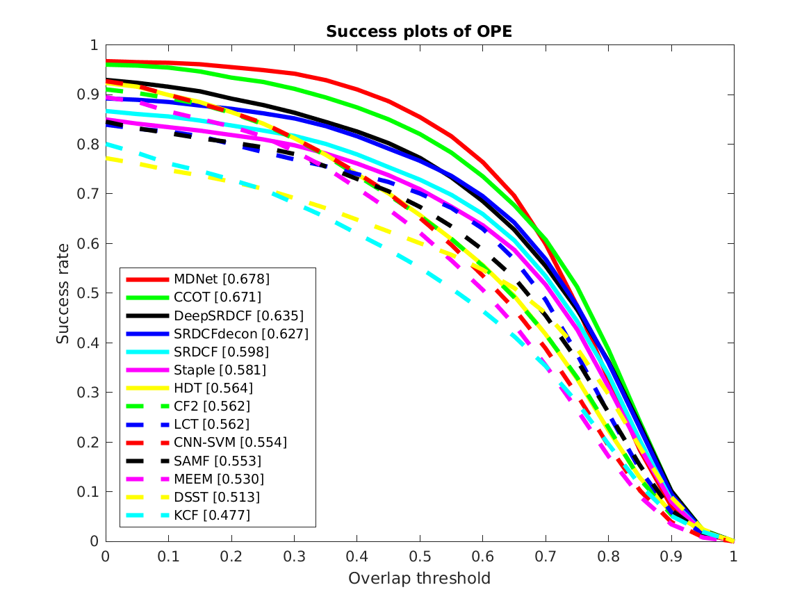

OTB Toolkit
===

This is a friendly toolkit for comparing your trackers and the state-of-the-art trackers on the Online Tracking Benchmark (OTB-2013 and OTB-2015). The source code is inherited from the official repository [Visual Tracking Benchmark](http://cvlab.hanyang.ac.kr/tracker_benchmark/index.html).

## Features
* Compatible tracking protocol
* Auto download and configure sequences
* Highly designable and modularized code
* Updated state-of-the-art results

## Usage

1. add your tracker repository to `trackers` folder, or use `git submodule init && git submodel update` to access the default ECO tracker
2. configure your tracker in file `configs/config_trackers.m`
3. evalutae your tracker on OTB100 by running `matlab -r "run_OPE;exit;"`

